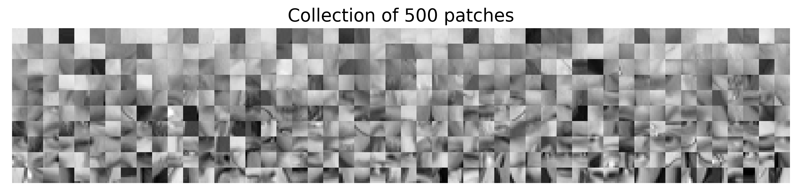
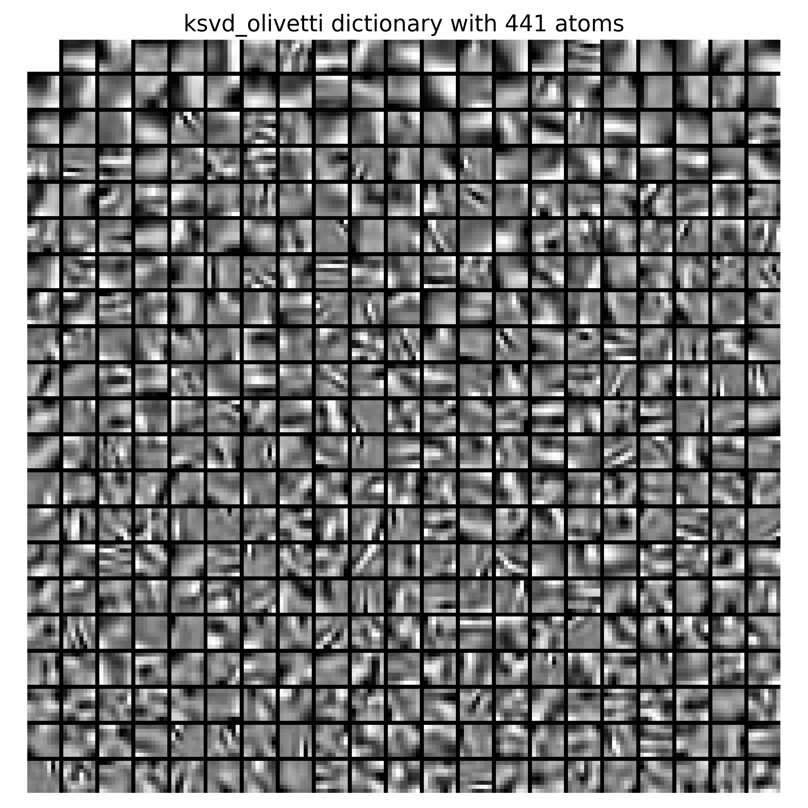
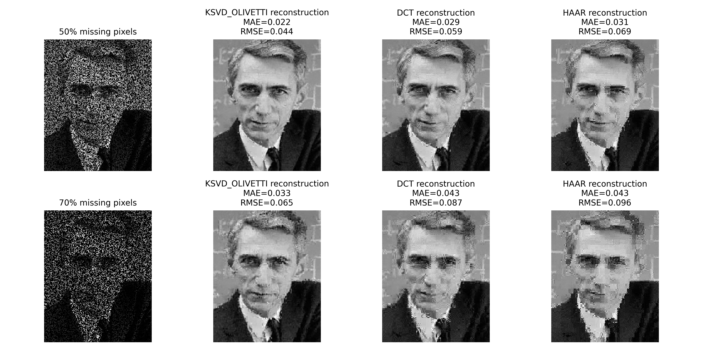

# K-SVD: dictionary design for sparse representation

* Implement the K-SVD algorithm described in [K-SVD: An Algorithm for Designing Overcomplete Dictionaries for Sparse Representation](https://legacy.sites.fas.harvard.edu/~cs278/papers/ksvd.pdf)
* Test the method on different use cases

### Implementation of the K-SVD method (only using numpy)

* `pursuits.py`: implements pursuit methods
* `dictionary_learning.py`: implement the K-SVD algorithm

### Atoms retrieval with synthetic data

* `synthetic_data.py`: create the synthetic data
* `synthetic_exp.py`: run the synthetic experiements described in the paper

### Reconstruction of signals with missing values

* `patch_data.py`: create overcomplete DCT, Haar and K-SVD dictionaries used to reconstruct images
* `patch_exp.py`: learn an overcomplete dictionary with K-SVD
* `missing_values.py`: run missing values experiments using DCT, Haar or K-SVD dictionary
* `examples/`: contains example images to run the missing values experiments

**Example of patches extracted from the Olivetti dataset**

**Learned KSVD dictionary**

**Comparison of reconstruction using the learned KSVD dictionary with overcomplete DCT or HAAR dictionaries**